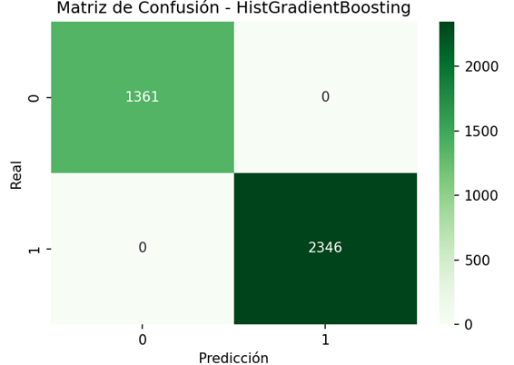
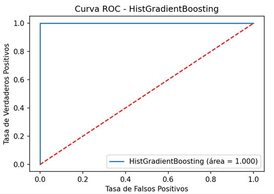

# Trabajo ML / Cloud Computing

- Integrantes:
- - Alvaro Gomez
- - Andres Moraga
- - Camilo Silva

El trabajo corresponde a un modelo de Machine Learning que predice la probabilidad de incumplimiento de pago en el crédito otorgado a los clientes.

En el archivo “Tabla_Trabajo_Grupal”, se encuentran la tabla “Desarrollo” con los siguientes campos para el modelamiento de Machine Learning cuyo objetivo es el de predecir la probabilidad de incumplimiento del pago de los clientes :

- Edad: Campo cuantitativo que detalla la edad del cliente.

- Nivel Educacional: Campo categórico que detalla el nivel educacional del cliente. 

- Años Trabajando: Campo cuantitativo con el detalle de los años trabajando del cliente. 

- Ingresos: Campo cuantitativo que detalla el monto encriptado del ingreso del cliente. 

- Deuda Comercial: Campo cuantitativo que detalla la deuda comercial del cliente. 

- Deuda Crédito: Campo cuantitativo que detalla la deuda consumo en crédito del cliente. 

- Otras Deudas: Campo cuantitativo que detalla el monto deudas, no comerciales ni consumo del cliente.

- Ratio Ingresos Deudas: Campo cuantitativo que detalla la proporción de ingresos sobre deudas totales del cliente.

- Default: Variable cuantitativa binaria, que detalla el incumplimiento del cliente en el pago (target). De esta manera el incumplimiento de pago de un crédito se define con el valor “1”.

Metodología de Desarrollo de Modelos:

1. Preparación y análisis de datos

Para realizar el análisis de las variables predictoras en el conjunto de entrenamiento, en primer lugar, se llevó a cabo un análisis exploratorio acompañado de un proceso de limpieza de datos.
Se identificaron 10.856 registros duplicados de un total de 12.356, por lo que se conservaron únicamente 1.500 registros.

	1.1 Dividir tablas de entrenamiento y test:

Para seleccionar el conjunto de entrenamiento, se generó una selección aleatoria mediante código en Python para la tabla desarrollo, el cual se puede verificar en el archivo anexo “01_Análisis_descriptivo.py”.

La cantidad de registros obtenidos fue la siguiente:

o	Conjunto de entrenamiento: 1.050 registros (70%)
o	Conjunto test: 450 registros (30%)

	1.2 Análisis descriptivo para conjunto de entrenamiento:

De acuerdo con los principales hallazgos obtenidos fueron los siguientes:

En relación con la variable objetivo, se puede apreciar que existe una alta probabilidad de incumplimiento de los clientes (63,81%)
Los resultados muestran que las variables “Edad”, “Deuda_Comercial” y “Ratio_Ingresos_Deudas, muestran una distribución con menos colas pesadas y menor dispersión, con valores en la media más cercanos a la mediana, lo que podría indicar una tendencia menos sesgada.
Por otro lado, las variables “Ingresos”, “Otras_Deudas” y “Deuda_Crédito” presentan asimetrías muy marcadas hacia la derecha. 

Análogamente, para la cantidad de registros donde no hubo incumplimiento de clientes (‘Default’ = 0), se obtienen 380 registros y la distribución es similar analizado anteriormente. 


	1.3 Descripción y comparación de variables independientes:

Para realizar un análisis descriptivo e identificar inicialmente las variables con mayor capacidad discriminativa, resulta útil examinar la matriz de correlación:

ρ(x,y)=  (cov(x,y))/√(var(x)∙var(y))

 

A partir de la matriz de correlación se observa que las variables Edad y Años_Trabajando presentan una mayor correlación con la variable objetivo. En otras palabras, a medida que aumentan sus valores, también se incrementa la probabilidad de incumplimiento de los clientes.

Por otro lado, las variables Deuda_Comercial y Ratio_Ingresos_Deudas muestran una correlación negativa con el Target, lo que indica que, a medida que aumentan sus valores, la probabilidad de incumplimiento disminuye.

Esto refleja un mayor poder discriminatorio de estas cuatro variables, para detectar clientes que cumplen o no.

Variables con mayor capacidad discriminativa:

	- Edad: 

Default = 1 (Incumplimiento)


Default = 0 (Cumplimiento)


	- Años_Trabajando: 

Default = 1 (Incumplimiento)


Default = 0 (Cumplimiento)


	- Deuda Comercial: 

Default = 1 (Incumplimiento)


Default = 0 (Cumplimiento)


	- Ratio_Ingresos_Deudas

Default = 1 (Incumplimiento)


Default = 0 (Cumplimiento)


Variables con poca capacidad discriminativa:

	- Nivel_Educacional

Para esta variable categórica podemos identificar los siguientes valores a probabilidad de incumplimiento según el conjunto de entrenamiento:

Nivel Educacional	Prob. Incumplimiento
Bas	73,33%
Med	63,54%
SupInc	63,95%
SupCom	55,14%
Posg	67,21%


Si bien existe una menor propensión de incumplimiento en la categoría “SupCom”, no se muestra una tendencia respecto a un nivel educacional más alto o bajo si se considera el nivel jerárquico de la siguiente forma:

Nivel 1: Bas → Educación básica.
Nivel 2: Med → Educación media.
Nivel 3: SupInc → Estudios superiores incompletos.
Nivel 4: SupCom → Estudios superiores completos.
Nivel 5: Posg → Estudios de posgrado.

	Otras Variables numéricas:

Cómo se vio anteriormente en la matriz de correlación, las variables numéricas 'Ingresos', 'Deuda_Credito' y 'Otras_Deudas', tienen un bajo poder discriminativo para poder predecir si un cliente cumple o no, por lo que se dejarán fuera en el modelo de entrenamiento, en el caso de utilizar un modelo de regresión logistica.

2.	Entrenamiento del modelo

De acuerdo con el análisis descriptivo realizado en el archivo “01_Análisis_descriptivo”, la decisión tomada es que se aplicarán los siguientes modelos de clasificación:

-	Regresión logística con balanceo de clases usando solo las variables con mayor poder discriminativo (‘Edad’, ‘Años_Trabajando’, ‘Deuda_Comercial’ y ‘Ratio_Ingresos_Deudas’).
-	RandomForest con todas las variables: 
-	HistGradientBoosting con todas las variables

Para los últimos 2 modelos se usarán todas las variables, ya que se usará una metodología que se entrena usando un pipeline completo que ya incluye imputación (SimpleImputer), escalado (RobustScaler) y codificación categórica (OneHotEncoder)

Producto de que se trata de un estudio de caso de clasificación binaria, la tasa de buena clasificación que se ocupará para evaluar los tres modelos será el Accuracy.

Luego, se elegirá el modelo con mayor Accuracy para hacer el despliegue en FastApi.

Los resultados obtenidos para estos 3 métodos fueron los siguientes:

•	Accuracy:

-	Logistic Regression:   0.7305
-	Random Forest:         0.9948
-	HistGradientBoosting:  0.9970

Producto de este resultado se selecciona el modelo HistGradientBoosting


 



# Requirements

\- Python3

\- pandas

\- numpy

\- matplotlib

\- seaborn

\- sklearn


Instalar los requerimientos usando:

```

pip3 install -r requirements.txt

```

# Metodología

De acuerdo al análisis descriptivo realizado en el archivo “01_Análisis_descriptivo”, la decisión tomada es que se aplicarán los siguientes modelos 

Modelos utilizados:

-	Regresión logística con balanceo de clases usando solo las variables con mayor poder discriminativo (‘Edad’, ‘Años_Trabajando’, ‘Deuda_Comercial’ y ‘Ratio_Ingresos_Deudas’).
-	RandomForest con todas las variables
-	HistGradientBoosting con todas las variables


De acuerdo al análisis descriptivo realizado en el archivo “01_Análisis_descriptivo”, la decisión tomada es que se aplicarán los siguientes modelos

## Changelog v0.1

- Se agregaron los archivos .py y el modelo .pkl